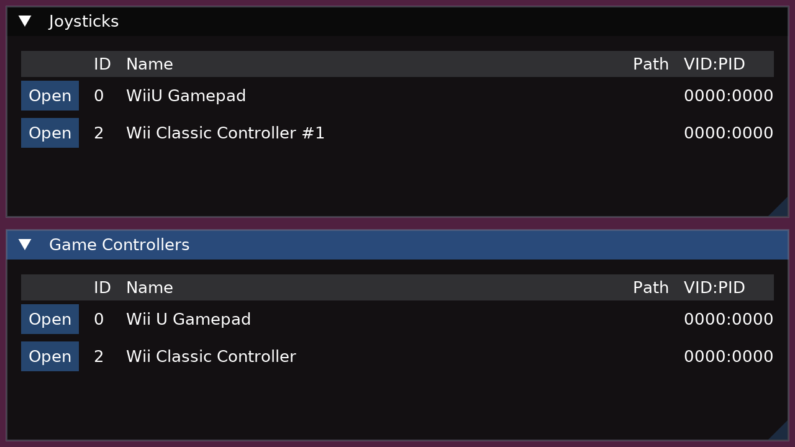
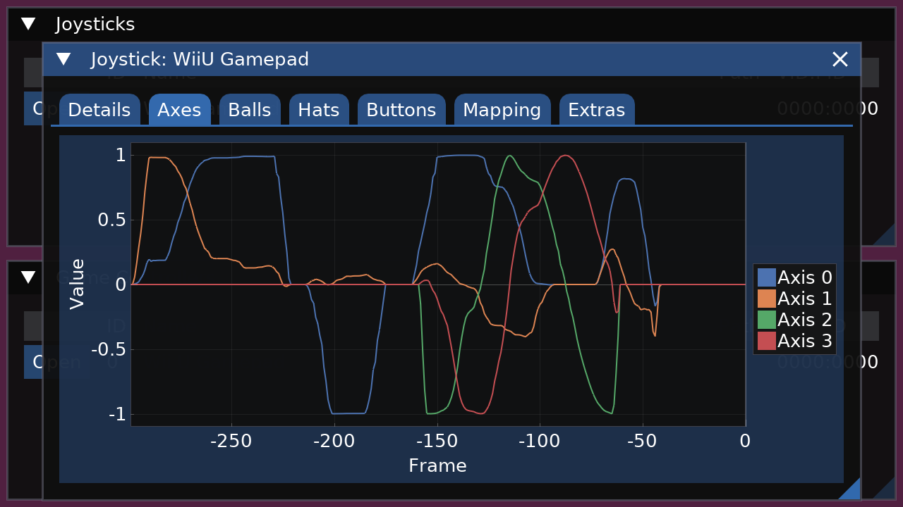
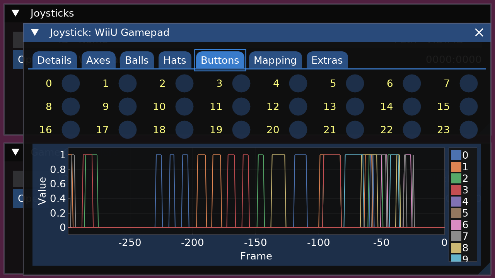
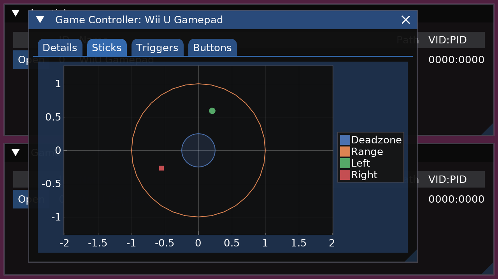

# SDL2 Game Controller Test

    

This is a simple application to visualize and test SDL2 game controllers.

Both the "Joystick" and "GameController" interfaces are accessible.

## Compiling from sources

### Dependencies

In order to build the app, you will need:

- a C++23 compiler.

- SDL2

- freetype2

### Build steps

If you use a release tarball, you can skip step 0.

0. `./bootstrap` at least once.
   
1. `./configure` every time you want to change a build option.

2. `make`

3. `make run` (optional)

4. `make install` (optional)

This is a standard Automake package. Use `./configure --help` to see all options
available.

This package has a specialized build setup for Wii U, meant for devkitPro environment. In
step 1, do this:

1. `./configure --enable-wiiu --host=powerpc-eabi`

